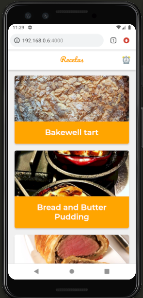

# Platzi Recetas

PWA que utiliza la API de MealDB para mostrar recetas con sus instrucciones. Algunas de las features que tiene son:

* Soporte Offline con Workbox
* Estrategias de Red apropiadas para cada recurso
* Add to Home Screen
* Web Share API
* Creado con [Create React App](https://github.com/facebookincubator/create-react-app).

## Instalación

Instalación de dependencias

    npm install
    npm add workbox-webpack-plugin react-app-rewire-workbox react-app-rewired

Si no está instalado serve de manera global

    sudo npm install -g serve

## Scripts

* `npm install` para instalar las dependencias
* `npm run dev` para entorno de desarrollo
* `npm run build && npm start` para producción

## Licencia

MIT